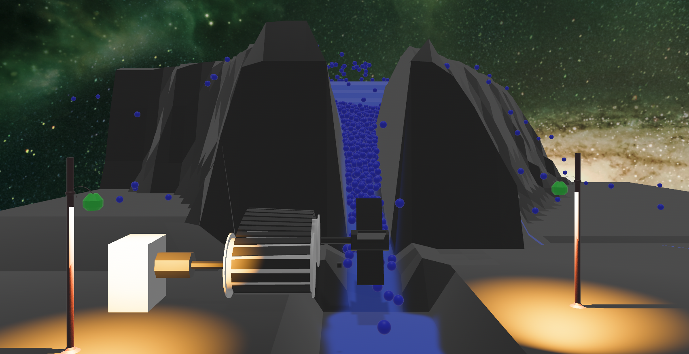

# Waterfall
Who has seen such big and round drops? That's right, no one, and who cares.  
The question is, will these drops be able to fall from above, spinning the turbine (sort of a turbine), transmit rotation via the caterpillar to the generator and eventually light the lantern?
And do all this using the bare physics that Avian3D provides without any other gadgets and trick.  
Answering this question, I learned a lot about Bevi, Avian3d and myself at the same time :)))

## Note
The hardest part here was making the damn caterpillar. I wanted to draw it in Blender like everything else, but there were a lot of problems with stretching it onto the rollers. It turned out that it was easier to create it at runtime.  
Maybe it can be done in another way, but I don’t know how)))  

## Caution
The code is not perfect because i'm still learning.

